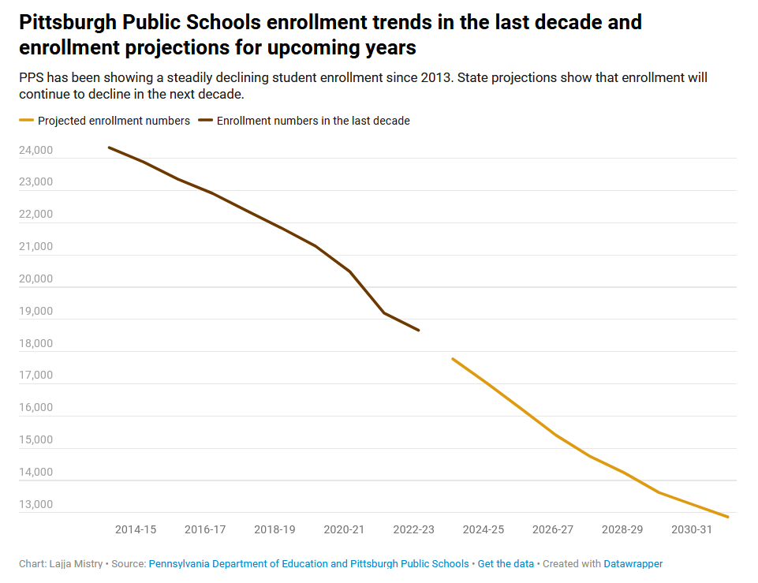

Link back to main portfolio page: [Click Here](/README.md)

# Assignment 3&4 Write Up

This assignment focused on redesigning an image found online. The main steps in this assignment were finding the original image, critiquing the original image, wireframing a solution, testing the solution, building the solution, retesting the solution, and making a final build of the solution. I talk about each step in the process on this page. 

## Original Image

The image I am redesigned in this assignment is located below. It is part of [this](https://www.publicsource.org/pps-enrollment-decline-pittsburgh-public-school-building-closures/) article from Public Source. I chose this image because education policy is a field of interest for me and I appreciate the work that Public Source does reporting on issues in Southwestern Pennsylvania. Additionally, I selected this visual because the story it tells is a powerful and important story. The story this information can tell is important, but the current graphic does not do a great job at telling the story in the most captivating way. I thought that many changes could be made to the image to make it more intuitive, captivating, aesthetically pleasing, and more useful for its audience. An effective graphic on this particular story (Pittsburgh Public Schools enrollment) should inspire viewers. The goal of my redesign was to present viewers with a useful, intuitive, and captivating graphic that conveys the seriousness of the issue and inspires audience members to engage with the issue and do something about it. This issue is important to me and should be to others, but the current graphic does not convey the importance of the information in an inspiring way. 

## The Redesign Process

### Critiquing The Original Image

Critiquing the original image was the first step in the redesign process. The critique method used for this assignment can be found [here](http://www.perceptualedge.com/articles/visual_business_intelligence/data_visualization_effectiveness_profile.pdf). This method reminded me that information in any graphic not only needs to be clear, but also useful for its intended audience. Understandable, intuitive information is just one aspect of an effective data visualization. It is crucial for any effective data visualization to communicate why the information it contains is useful. As it relates to redesigning the original graphic, this encouraged me to focus on the title and subtitle as ways to make the information more useful. Similarly, this critique method made me really think about who the intended audience was for this graphic. With them in mind, I could create a more effective graphic. I had Pittsburgh Public Schools (PPS) parents or potential PPS parents in mind when doing my redesign. 

Overall, the critique method helped me to identify the main aspects I wanted to change when redesigning the graphic. The graph needs more context as to why the information is useful and important. This could come from a better title and subtitle that point to an idea, not just the structure of the graphic. Additionally, the chart could use a better distinction between actual and projected data as the gap between the two lines in the original is awkward and unintuitive. The color scheme could also be improved and simplified to increase the attractiveness of the chart. Lastly, there is too much clutter because of the gridlines, axis values, and amount of text. These are all things I tried to improve in the redesign.  

### Wireframing a Solution

I knew that the redesign was still going to be a line chart and it would look similar but more effective than the original. Because of this, I thought it was most important to start off the wirefame process by brainstorming titles and subtitles. 

The goal of the title was to highlight the main idea of the information: that PPS enrollment is decreasing and projected to continue doing so. It was important to do this in the least amount of text possible. The idea was to get the point across, but do it in a way that has the least possible amount of clutter. I felt comfortable with the proposed title on my fourth iteration, which is shown with the circled star in the image below. I likewise felt comfortable with the subtitle on its fourth iteration which is shown in the same way in the image. The goal of the subtitle was to show why the information in the graphic is important and provide context as to why declining enrollment is bad. The original graphic lacked context and an effective subtitle. The subtitle is crucial to conveying the chart’s usefulness, importance, and context. I also tried to create an effective subtitle with the least amount of text possible. 

With an effective title and subtitle in mind, I began to sketch a solution. The use of red in these sketches was intentional. I knew that I wanted to use red for the line because of its negative connotation. Decreasing PPS enrollment is a bad thing with negative consequences (see subtitle). It felt appropriate to use red. In the first sketch, I took a simplified approach to the original chart. I used only one color, made the line continuous, simplified the axis labels (and all other labels), and had the Y-axis start at 0 instead of 13,000. The issue with this sketch was that the new scale did not show the trend clearly enough and there was too much white space in the chart. With these self-critiques in mind, I created a second sketch that had a Y-axis starting at 12,000. The trend was now obvious, but I was concerned that the difference between projected and actual data was not clear enough. With more self-critiques in mind, I created a third sketch that added a solid black line and arrow to indicate when the projections started. In this case, the trend was obvious and so was the difference between the actual and projected data. However, I thought that the black lines would be too distracting (and hard to create in Tableau or Flourish). These three sketches are seen in the image below (marked by the circled 1,2, and 3). 

With even more self-critiques in mind, I created a fourth sketch (seen below) that sought to make the projected and actual data difference clear without adding clutter. I added two labels to make the distinction clear, but not distracting. I thought that the two labels created far less clutter than the black lines in the third sketch. 

At this point, I felt comfortable with the sketches I had and wanted to create a fifth and final sketch that brought everything together. This was the sketch that I showed first in the user research phase. This graphic (seen below) has all the elements of the fourth sketch and also has a title and subtitle. I felt like I had successfully redesigned a more effective and useful chart. It becomes obvious in the next section of this write up that I had many blind spots in my redesign. I am thankful for user research and the iterative redesign process! 

### Testing the Solution (User Research)

I got feedback on the fifth sketch from two people. This helped me identify blind spots and areas of improvement before creating the final solution. User 1 is a 25-year-old working adult. User 2 is a high school math teacher who student taught in PPS but now works in a different district. I asked them these questions: 
- Can you tell me what you think this is?
- Can you describe to me what this is telling you?
- Is there anything you find surprising or confusing?
- Who do you think is the intended audience for this?
- Is there anything you would change or do differently?
- Do you think this is an appropriate graph for this story/information? 
- How does the color scheme work?

Both users mentioned that the axes were confusing and that adding a label would be helpful. They also both were able to intuitively guess after looking at the graph what the axes represented, but both said labels would make that connection much clearer. It was also clear to both users that the sketch showed a trend of decreasing PPS enrollment. They also both agreed that a line chart was an appropriate graph choice. The scale on the Y-Axis (that basically started at 12,000) was confusing to User 1, but not User 2. User 1 was also confused by the X-axis as it was not immediately clear that it was referring to years. I wanted to eliminate that potential confusion in the final redesign, and they suggested putting “20” before the X-axis values. 

In terms of comments unique to User 2, they did mention that the chart was not super attractive, but that it got the point across. They also agreed that red was the best color to use. They also mentioned that they felt like the sketch had more text than the original. I knew this was not true, but still should have kept that comment in mind when doing the first final redesign. I could have done more (like change the text size) to make the text look and feel like it was less than before.

Both users had different answers for the intended audience. User 1 that this chart would be something a school board would show to either parents or local government. They also thought that this chart would be posted in the news to the general public as a ‘fear mongering thing.’ User 2 thought that the intended audience was people in charge of the school district, school board members, or school administrators. They did not think that this chart was intended for families or kids because they cannot do anything about decreasing enrollment. With their PPS experience, they also mentioned that this information would not be surprising to a parent, especially parents thinking of unenrolling their children. This is something that would not change their mind on PPS or encourage them to unenroll since they would already know about declining enrollment. 
