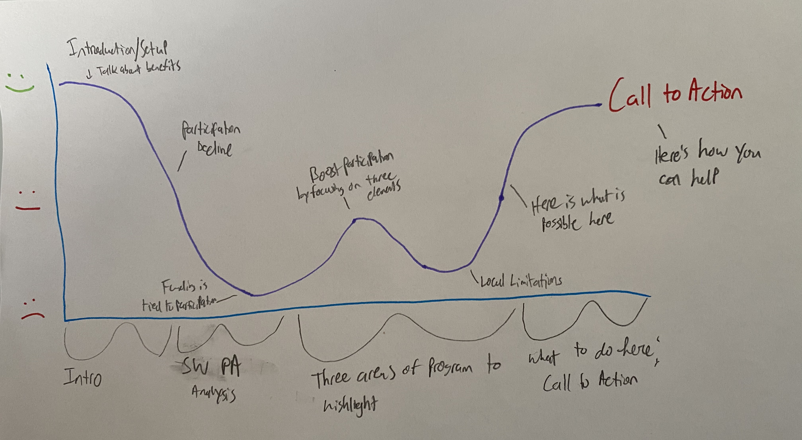
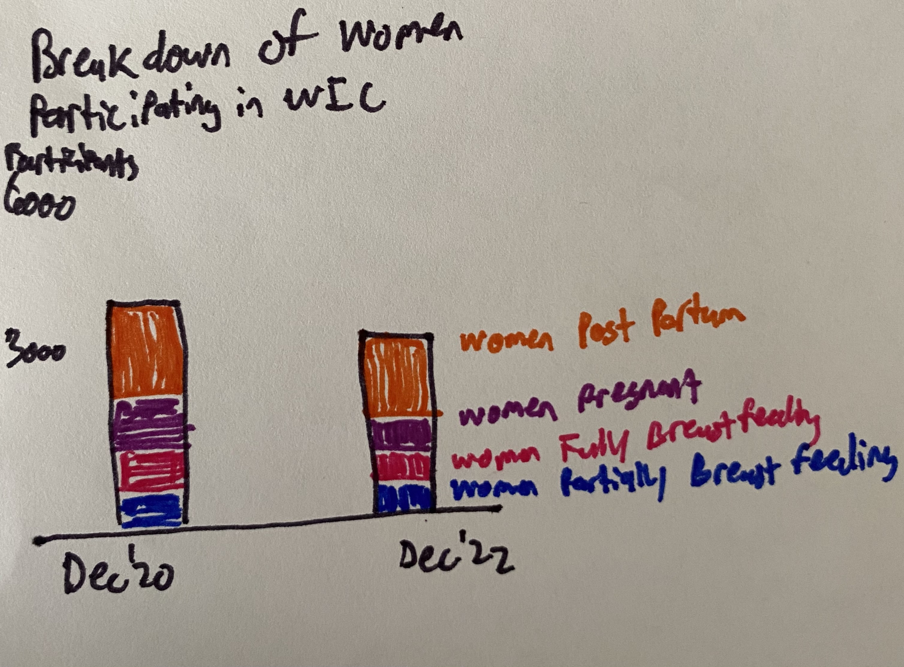
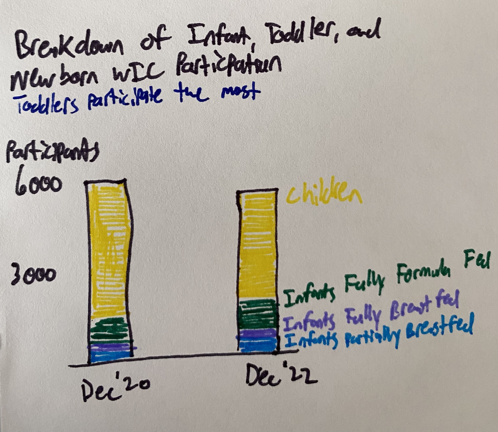
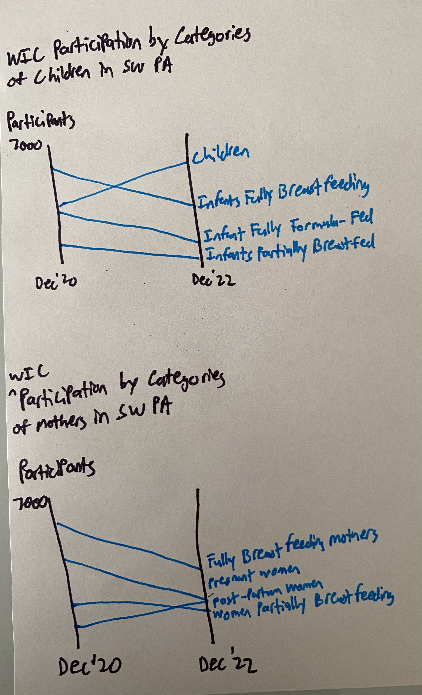
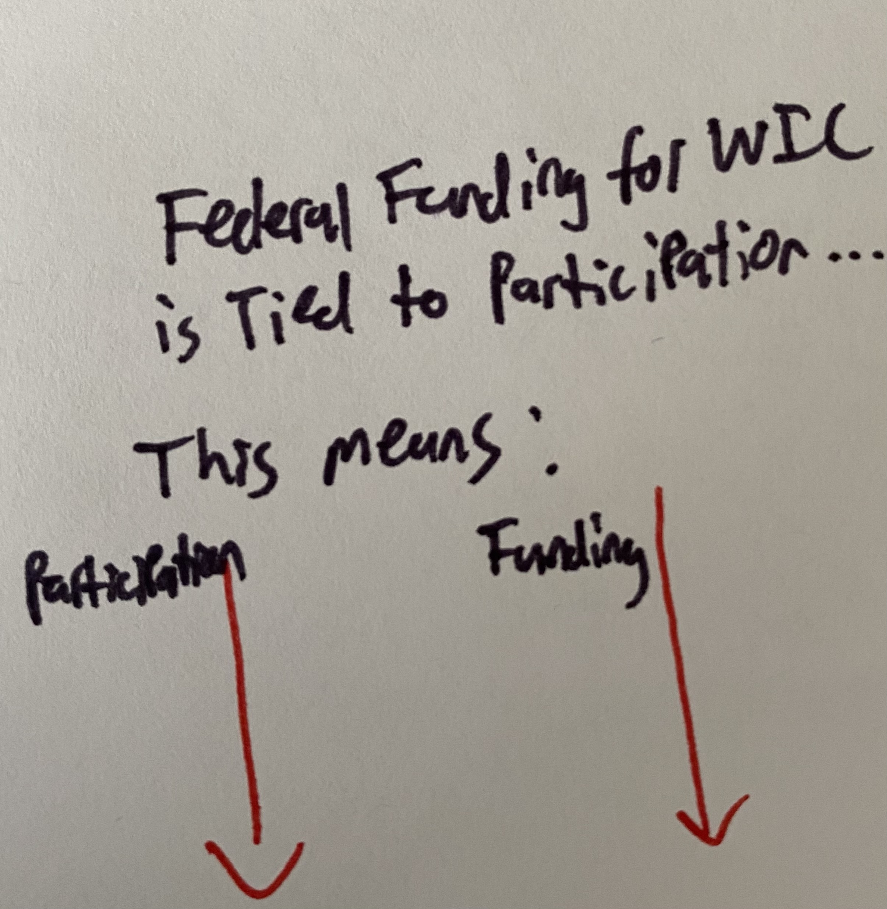
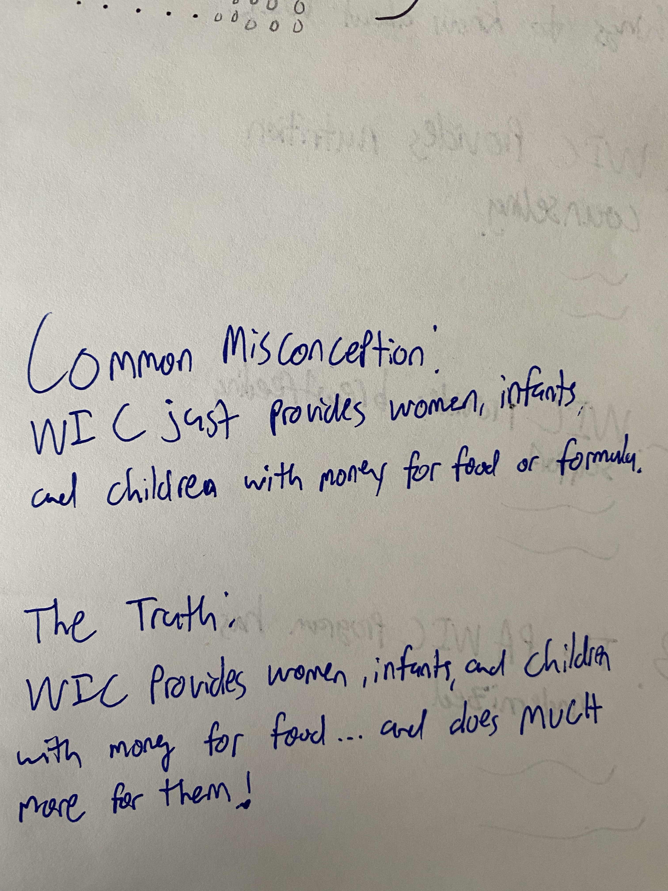
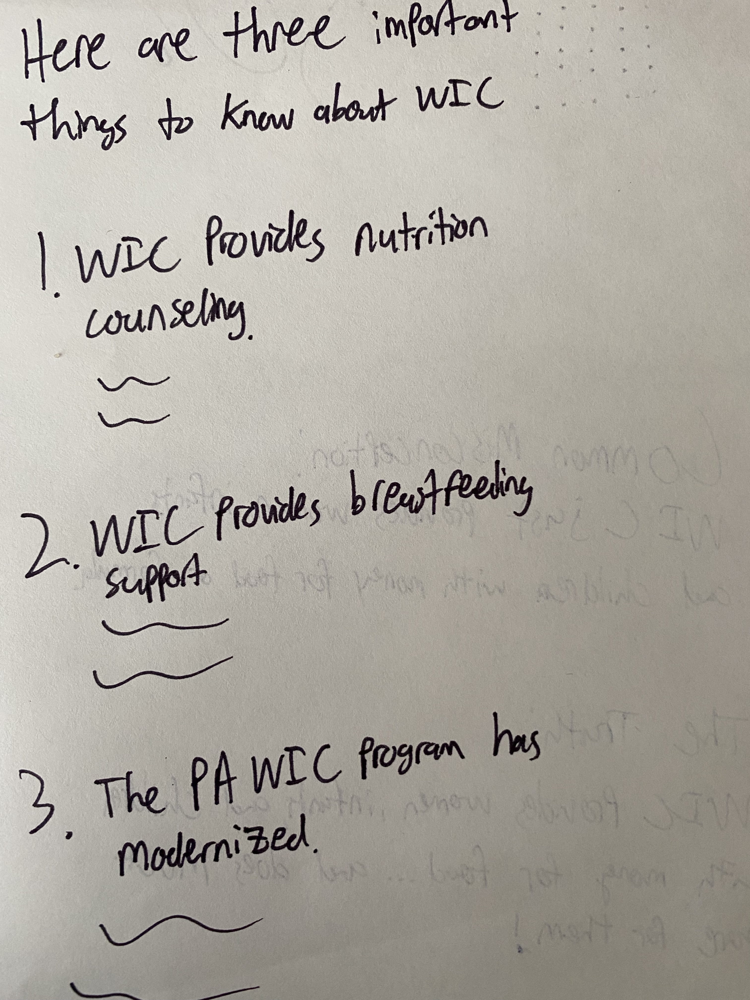

| [home page](https://aburrou2.github.io/burroughs-portfolio/) | [visualizing debt](dataviz2) | [critique by design](Assignment34) | [final project I](final-project-part-one) | [final project II](final-project-part-two) | [final project III](final-project-part-three) |

# Outline

### Project Summary

For my final project, I want to focus on Special Supplemental Nutrition Program for Women, Infants, and Children (WIC) participation in Southwestern Pennsylvania (Butler, Beaver, Washington, Allegheny, and Westmoreland Counties). This an impactful program that delivers tangible benefits to women, infants, and children. The program is underutilized and there are many people who are eligible, but not participating in the WIC program. WIC participation is decreasing in Pennsylvania, and federal funding for WIC is tied to the participation rate. This means Pennsylvania’s decreasing participation lowers the amount of funding for the PA WIC program. This is an important part of the story to tell that can help to explain why decreasing WIC participation is troublesome. 

The state WIC office has started releasing participation data for each county in Pennsylvania and there are two years’ worth of participation data. At a high level, this project will provide summary statistics of WIC participation in the region over the last two years. It will also showcase WIC’s impact on the health outcomes of program participants. 

WIC participation is decreasing, but this project will tell the story of participation across the different categories of WIC participants (Children, Fully Breastfeeding Mothers, Infants Fully Breastfeeding, Infant Fully Formula-Fed, Infants Partially Breastfed, Women Partially Breastfeeding, Post-Partum Women, and Pregnant Women). Is participation decreasing in each category of the program? This is an important high-level question to answer. Lastly, this project will drill down further from the participation data and highlight benefits or aspects of the program that many others do not know about. It will debunk the common misconception that WIC only provides women and children with money for food. 

### One sentence summary

WIC Is an impactful program, but less families in Southwestern Pennsylvania are participating and more promotion of lesser known program aspects can increase participation.  

### Intended Audience

There are two intended audiences for this presentation. The first intended audience for this presentation is residents of Southwestern Pennsylvania. This audience should understand the following after my presentation. “As a Southwestern Pennsylvania resident, I want more awareness of programs that can benefit people in my community so that my neighbors and I can coexist in a healthy, thriving community.” 

The second intended audience for this presentation is Pennsylvania policymakers. This audience should understand the following after my presentation. “As a policymaker or elected official, I want more awareness of WIC so that I can enact and/or advocate and/or promote program benefits or potential program improvements.”

### Broad Outline
Setup: WIC is an impactful program with clear benefits to health outcomes for women, infants, and children.
Conflict: WIC funding is tied to participation and less people are participating in SW PA despite the benefits. 
Resolution: Raising awareness of aspects of the Pennsylvania WIC program that many people do not know about can increase participation. 

### Specific Details of Outline
Setup: I will talk about what WIC is and showcase the impact on health impacts for program participants. I will highlight the health outcomes of WIC participants using downward and upward arrows (i.e. WIC participants see an increase in these good health outcomes and a decrease in these bad health outcomes). The outcomes will ideally be broken down by women and children, meaning each group will get their own set of arrows. 

Conflict: At this point, I will provide a high-level overview and show summary statistics on WIC program participation. I will show who is using the program now (in a stacked bar chart) and then show participation rates from December 2020 to December 2022 in a slope chart. Both of these graphics will be broken out by the categories of program participants. I will end this section of the presentation by showing a unit chart of how many eligible people in Pennsylvania are participating (which is around 50%) in a unit chart. Lastly, I will add the caveat that funding is tied to participation and less participation means less funding to staff the program, provide outreach, and assist women and children in need. 

Resolution: There is a common misconception that WIC just provides families with money to buy food or formula.  I will highlight three areas of additional benefits of WIC that could encourage people who are not participating to participate. These three components of WIC are breastfeeding support, nutrition education/counseling, and program modernization. It will be important to highlight the limitations of these aspects in Pennsylvania (N.B. PA lags behind most states in terms of WIC modernization and digital transformation). I will then talk about how these components fit into SW PA and end with my call to action, encouraging the audience to spread awareness in the region about the benefits of WIC and the capacity for additional participants. This part of the presentation will focus less on data visualization and more on digital storytelling. The final deliverable (but not the final pitch presentation) will contain a second call to action for policy makers where I challenge them to advocate for and promote program benefits and improvements that will increase participation in the Pennsylvania WIC program. 

### Story Arc

The outline contains more details on aspects of the Story Arc. This Story Arc is different from the in-class exercise as my idea has been refined in the last few weeks.

## Initial sketches

Here are sketches of anticipated data visualizations. I anticipate that some of the titles will change between now and the final deliverable. I also would like to note that the scale on these images is different than it will be in the actual visualizations. Lastly, I plan on employing a consistent color scheme throughout my story. That means that if a category of the WIC program (e.g. post-partum women) is purple in one visualization, it will be purple in all other visualizations. 

After introducing what WIC is, I would like to include something similar to the image below, which visualizes the benefits of WIC for children and women. The goal in this image is to highlight the positive health outcomes of WIC participants.

I would then like to provide a high-level overview of who is using the program. By this I mean, I would like to visualize what groups of eligible people are participating the most. A stacked bar chart makes sense for this visualization as it allows for a simple year to year comparison of the proportions of WIC participants by category. I also think it makes sense to break this out and do separate charts for mothers and children. This would hopefully clearly show what proportions of mothers and children are participating in WIC. 

After that, I would then provide a high-level overview of WIC participation and how it has changed among the different categories of participating women and children. I think a slope chart makes sense to visualize this since I want to present a year vs. year comparison and clearly show the trends. 

After showing the trends in enrollment, I think it makes sense to remind the audience that funding for the program is tied to participation. At this point, my audience's mood should be at its lowest point. Decreasing participation and funding tied to participation represents a compelling, but disappointing story. After that, I also think I could show the audience just how many eligible Pennsylvanians are not participating in the program. A unit chart would be great for that and that is what I sketched below. A unit chart and Shorthand's ability to scroll (and mimic a sense of animation) will work well together. Because of that ability, I could mimic the unit chart flipping to separately highlight what proportion of people eligible for WIC are participating and what proportion are not. I would have to make two unit charts, and the other unit chart would be the opposite of the sketched unit chart below. 

At this point in the story, I think it makes sense to talk more positively about WIC components that people often do not know about that can increase participation. WIC is much more than just providing money for food to mothers and children and it is important to make that distinction (as seen in the first image below). If people knew that and knew how else it could benefit them, they may be more inclined to participate in the program. This portion will be more text based than the other sections and will rely more on Shorthand's ability to scroll and focus on one thing at a time. The three WIC components I would like to highlight are in the second image below. After highlighting the three components, I will talk about limitations those components may have in the region and then highlight the benefit they could have as I transition into my call to action. I have yet to determine what role digital storytelling will have in this final aspect of the project/presentation. 

# The data

The data for this presentation will come from publicly available data sources. The participation data will come from one source, the Pennsylvania WIC program office. They have monthly participation data from December 2020 to December 2022. The participation data is available in many forms. It is all available at the county level. The available data includes WIC participation by race, by type of participant (i.e. the aforementioned categories of participation), and by total participation in a county. For this story, I will use the participant type and total participation data. The data is already cleaned and the only manipulation I anticipate will revolve around changing the data structure for the data visualization tool. Since I am only focusing on five counties, I will have to eliminate data for the other 62 counties in Pennsylvania. 

Data for estimated eligibility in Pennsylvania and Pennsylvania counties will come from a report by Thriving PA. Thriving PA is an organization that advocates for perinatal and child health in Pennsylvania. Their eligibility data is from February of 2022. The participation data goes through December of 2022. When visualizing December 2022 participation as it relates to the most recent eligibility numbers (from February of 2022) I will clearly document that these numbers are not from the same month. I will also state that they are both the most recent available data on these topics. 

I will also incorporate statistics from reports into my final presentation. These statistics will highlight the improved health outcomes of mothers and children participating in WIC. They will come from a publicly available report that the National WIC Association created. 

Links to all the data/information I plan on incorporating into the final project are located in the table below. 

| Name | URL | Description |
|------|-----|-------------|
|Pennsylvania WIC Program Data|[Link](https://www.pawic.com/PAWICProgramData.aspx)  |Publicly available PA WIC participation data from the state WIC office|
|Thriving PA|[Link](https://thrivingpa.org/wp-content/uploads/2022/06/Pennsylvania-WIC-Fact-Sheet-2022.pdf)|Publicly available report that has data on eligibility and participation|
|National WIC Association|[Link](https://thewichub.org/the-state-of-wic/)|Public report on WIC that has statistics on health outcomes for WIC participants|

# Method and medium

I plan on using Shorthand to tell my story and will use it to create my final presentation. I will create my data visualizations using Tableau and/or Flourish. 

# In-Class Feedback

I received helpful feedback when I walked my group through part one of my final project. They liked my story arc and how the visualizations fit into the story arc, especially the mention of funding tied to participation as a low point in the story arc. They said that would build suspense and make the story compelling. It adds a sense of desperation to the story. Another piece of feedback I got was about using the unit chart to visualize the proportion of eligible people participating in WIC. They mentioned that I could use animation to toggle between unit charts visualizing the proportion of eligible people who participate and those that do not participate in WIC. Because of this feedback, I added more detail about how I plan to incorporate unit chart visualizations into my story and that I plan to have two unit charts and mimic animation using Shorthand. Lastly, the group mentioned that I should consider adding a second call to action for policymakers. They recommended that I should consider the class and also policymakers as a potential audience. I agree that policymakers are an important group to consider as the audience and as a result, I added a second description of the audience in this write up. 
