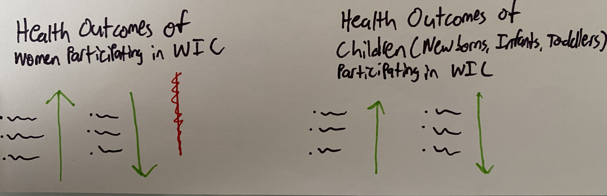
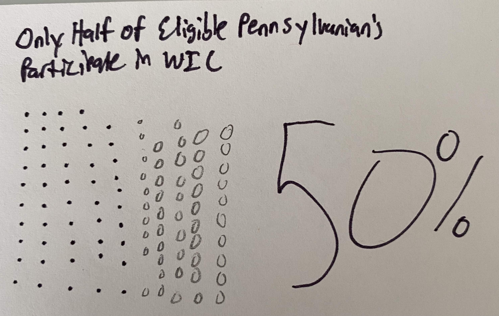

| [home page](https://aburrou2.github.io/burroughs-portfolio/) | [visualizing debt](dataviz2) | [critique by design](Assignment34) | [final project I](final-project-part-one) | [final project II](final-project-part-two) | [final project III](final-project-part-three) |

# Outline

### Project Summary

For my final project, I want to focus on Special Supplemental Nutrition Program for Women, Infants, and Children (WIC) participation in Southwestern Pennsylvania (Butler, Beaver, Washington, Allegheny, and Westmoreland Counties). This an impactful program that delivers tangible benefits to women, infants, and children. The program is underutilized and there are many people who are eligible, but not participating in the WIC program. WIC participation is decreasing in Pennsylvania. Federal funding for WIC is tied to the participation rate. This means Pennsylvania’s decreasing participation lowers the amount of funding for the PA WIC program. This is an important part of the story to tell that can help to explain why decreasing WIC participation is troublesome. 

The state WIC office has started releasing participation data for each county in Pennsylvania and there are two years’ worth of participation data. At a high level, this project will provide summary statistics of WIC participation in the five counties over the last two years. It will also showcase WIC’s impact on the health outcomes of program participants. 

WIC participation is decreasing, but this project will tell the story of participation across the different categories of WIC participants (Children, Fully Breastfeeding Mothers, Infants Fully Breastfeeding, Infant Fully Formula-Fed, Infants Partially Breastfed, Women Partially Breastfeeding, Post-Partum Women, and Pregnant Women). Is participation decreasing in each category of the program? This is an important high-level question to answer. Lastly, this project will drill down further from the participation data and highlight benefits or aspects of the program that Pennsylvania WIC clients like, but many others do not know about. 

### One sentence summary

WIC Is an impactful program, but less families in Southwestern Pennsylvania are participating and more promotion of lesser known (but very liked) program aspects can increase participation.  

### Intended Audience

The intended audience for this presentation is residents of Southwestern Pennsylvania. The audience should understand the following after my presentation. “As a Southwestern Pennsylvania resident, I want more awareness of programs that can benefit people in my community so that my neighbors and I can coexist in a healthy, thriving community.” 

### Broad Outline
Setup: WIC is an impactful program with clear benefits to health outcomes for women, infants, and children.
Conflict: WIC funding is tied to participation and less people are participating in Allegheny County despite the benefits. 
Resolution: Raising awareness of the aspects of the Pennsylvania WIC program that many people do not know about can increase participation. 

### Specific Details of Outline
Setup: I will talk about what WIC is and showcase the impact on health impacts for program participants. I will highlight the health outcomes of WIC participants using downward and upward arrows (i.e. WIC participants see an increase in these good health outcomes and a decrease in these bad health outcomes). The outcomes will ideally be broken down by women and children, meaning each group will get their own set of arrows. 

Conflict: At this point, I will provide a high level overview and show summary statistics on WIC program participation. I will show who is using the program now (in a stacked bar chart) and then show participation rates from December 2020 to December 2022 in a slope chart. Both of these graphics will be broken out by the categories of program participants. I will end this section of the presentation by showing a unit chart of how many eligible people in Pennsylvania are participating (which is around 50%) in a unit chart. Lastly, I will add the caveat that funding is tied to participation and less participation means less funding to staff, provide outreach, and assist women and children in need. 

Resolution: There is a common misconception that WIC just provides families with money to buy food or formula.  I will highlight three areas of additional benefits of WIC that could encourage people who are not participating to participate with greater awareness. These three components of WIC are breastfeeding support, nutrition education, and program modernization. It will be important to highlight the limitations of these aspects in Pennsylvania (N.B. PA lags behind most states in terms of WIC modernization and digital transformation). I will then talk about how these components fit into SW PA and end with my call to action, encouraging the audience to spread awareness in the region about the benefits of WIC and the room for additional participants. This part of the presentation will focus less on data visualization and more on digital storytelling. 

### Story Arc

The outline contains more details on aspects of the Story Arc. This Story Arc is different from the in-class exercise as my idea has been refined in the last few weeks.

## Initial sketches

Here are sketches of anticipated data visualizations. In these sketches, I anticipate that some of the titles will change between now and the final deliverable. I also would like to note that the scale on these images is different than it will be in the actual visualizations. Lastly, I plan on employing a consistent color scheme throughout my story. That means that if a category of the WIC program (e.g. post-partum women) is purple in one visualization, it will be purple in all other visualizations. 

After introducing what WIC is, I would like to include something similar to the image below, which visualizes the benefits of WIC for children and women. The goal in this image is to highlight the positive health outcomes of WIC participants.

I would then like to provide a high level overview of who is using the program. By this I mean, I would like to visualize what groups of eligible people are participating. A stacked bar chart makes sense for this visualization as it allows for a simple year to year comparison of the make up of WIC participants by cateogry. I also think it makes sense to break this out and do separate charts for mothers and children. 

After that, I would then provide a high level overview of WIC participation and how it has changed among the different categories of participating women and children. I think a slope chart makes sense to visualize this since I want to present a year vs. year comparison and clearly show the trends. 

After showing the trends in enrollment, I think it makes sense to remind the audience that funding for the program is tied to participation. I also think at this point I could show the audience just how many eligible Pennsylvanians are not participating in the program. A unit chart would be great for that and that is what I sketched below. 

At this point in the story, I think it makes sense to talk more positively about WIC components that people often do not know about that can increase participation. WIC is much more than just providing money for food to mothers and children. If people knew that and knew how else it could benefit them, they may be more inclined to participate in the program. This portion will be more text based than the other sections and will rely more on Shorthands ability to scroll and focus on one thing at a time. 

# The data
> A couple of paragraphs that document your data source(s), and an explanation of how you plan on using your data. 

Text here...

> A link to the publicly-accessible datasets you plan on using, or a link to a copy of the data you've uploaded to your Github repository, Box account or other publicly-accessible location. Using a datasource that is already publicly accessible is highly encouraged.  If you anticipate using a data source other than something that would be publicly available please talk to me first. 

| Name | URL | Description |
|------|-----|-------------|
|Pennsylvania WIC Program Data|[Link](https://www.pawic.com/PAWICProgramData.aspx)  |             |
|Thriving PA|[Link](https://thrivingpa.org/wp-content/uploads/2022/06/Pennsylvania-WIC-Fact-Sheet-2022.pdf)|             |
|      |     |             |

# Method and medium

I plan on using Shorthand to tell my story and will use it to create my final presentation. I will create my data visualizations using Tableau and/or Flourish. 
